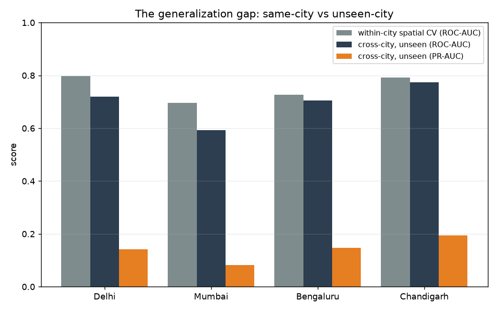
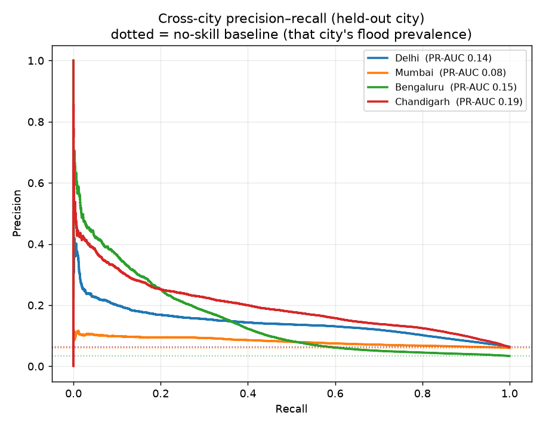
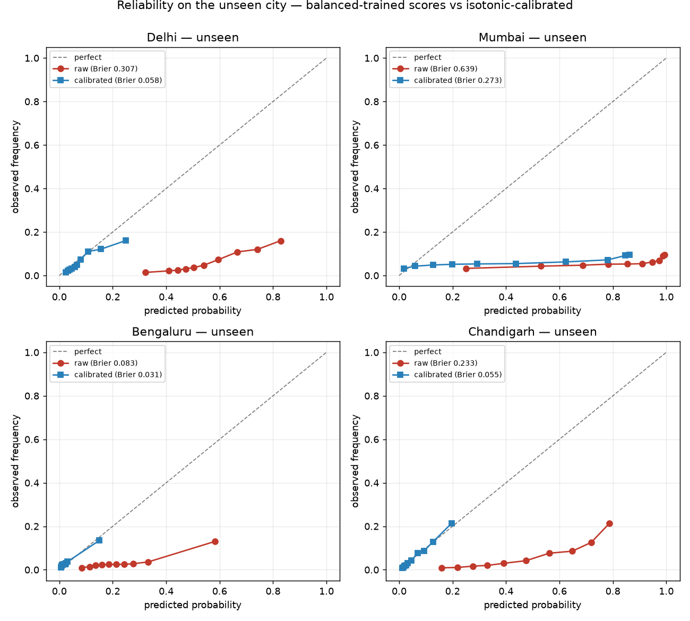

# Cross-city evaluation: does the model work in a city it has never seen?

Most flood-ML work reports a cross-validation score from holding out *areas of the same
city* the model trained on. That answers a soft question. The hard, honest question for a
tool that claims to "scale to any city" is:

> Train on some cities. Predict a city the model has **never seen.** How good is it *really*?

This is that test, run as **leave-one-city-out**: for each city, train on the other three
and evaluate on the held-out one. It also scores the model the way a **rare-event** problem
demands — floods are a few percent of pixels, and the usual ROC-AUC hides that.

Reproduce in one command (runs on the data already in `data/`, no Earth Engine):
```bash
floodml eval-crosscity
```

## Protocol

- **Model** — the same XGBoost (300 trees, depth 4) as the per-city models; only the
  training set changes, so the comparison is apples-to-apples.
- **Train** — a balanced flood/dry sample pooled from 3 cities.
- **Test** — the held-out city, sampled at its **true (natural) flood prevalence**, so
  precision, PR-AUC and calibration reflect reality, not a 50/50 fiction.
- **Metrics** — ROC-AUC (compared to the within-city number → the *generalization gap*);
  PR-AUC / average precision (compared to the no-skill baseline = that city's prevalence);
  and Brier score with reliability curves, raw vs isotonic-calibrated.

## Results

| Held-out city | Flood prevalence | Within-city ROC-AUC | **Unseen-city ROC-AUC** | Δ vs within | Unseen PR-AUC (baseline) | Brier raw → calibrated |
|---|---|---|---|---|---|---|
| Delhi | 6.3% | 0.797 | 0.719 | −0.078 | 0.141 (0.063) | 0.307 → 0.058 |
| Mumbai | 6.0% | 0.696 | **0.593** | −0.104 | 0.081 (0.060) | 0.639 → 0.273 |
| Bengaluru | 3.4% | 0.728 | 0.706 | −0.022 | 0.147 (0.034) | 0.083 → 0.031 |
| Chandigarh | 6.3% | 0.791 | 0.774 | −0.018 | 0.195 (0.063) | 0.233 → 0.055 |



## Three honest findings

**1. The model partly transfers — except to Mumbai.** Predicting an unseen *inland* city
(Bengaluru, Chandigarh, Delhi) costs only 0.02–0.08 ROC-AUC. But Mumbai falls to
**0.593 — barely above a coin toss.** That isn't noise, it's physics: Mumbai's flooding is
coastal and tidal, a mechanism the inland-trained model never saw. It's the clearest
possible case for the v2 plan (a Mumbai-specific tidal feature and the drainage-entity
layer) — and exactly the failure a same-city score would have hidden.

**2. ROC-AUC flatters; PR-AUC tells the truth.** Floods are 3–6% of pixels. Against that, an
unseen-city PR-AUC of 0.08–0.19 — only ~1.4–4× the no-skill baseline — is the real measure
of usefulness, and far less rosy than the 0.6–0.8 ROC-AUCs suggest. Mumbai's 0.081 against a
0.060 baseline confirms: almost no skill there.



**3. A balanced-trained model's raw scores are not probabilities — but calibration fixes it,
and transfers.** Training on a 50/50 sample makes the model emit ~0.5-centred scores at a
6%-prevalence reality (raw Brier 0.23–0.64; the red curves sit far below the diagonal). An
isotonic calibrator fit on the *training* cities and applied to the *unseen* one pulls the
reliability curve onto the diagonal (Brier down to 0.03–0.06) for every city where the model
ranks well. Where it doesn't (Mumbai), calibration helps but can't rescue it — you can't
calibrate a model that can't separate the classes.



## What this means

The honest headline isn't "AUC 0.96." It's three sentences:

> The model **generalizes moderately to unseen inland cities, fails on coastal Mumbai, and
> is only useful once calibrated.**

Those sentences are worth more than an inflated number — and they set the v2 priorities
directly (see the [roadmap](ROADMAP.md)): a coastal/tidal feature, the drainage-entity
layer, and reporting calibrated, rare-event-appropriate metrics as the default.

---

*Deterministic given the seed. Code: [`src/floodml/eval_crosscity.py`](src/floodml/eval_crosscity.py). Raw numbers: [`results/crosscity_river.json`](results/crosscity_river.json).*
