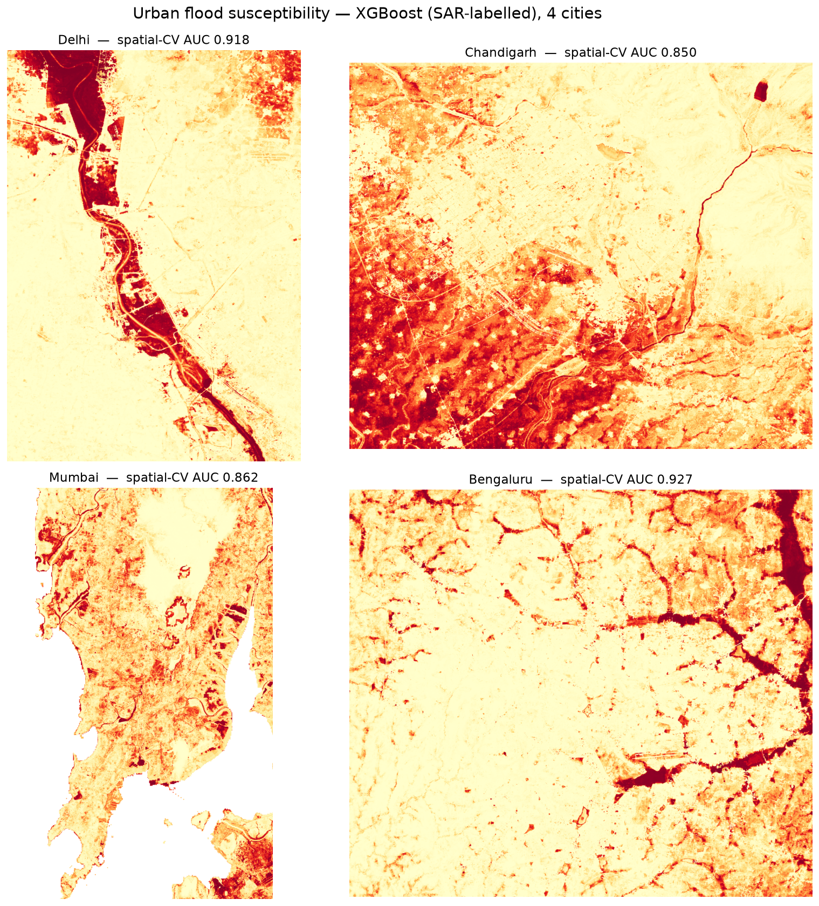

# urban-flood-ml

A **config-driven, multi-city** urban-flood susceptibility pipeline. One YAML per city → Sentinel-1 SAR flood labels + a terrain & drainage feature stack + a per-city **XGBoost** model validated with **spatial** cross-validation. Built as an installable package with a CLI, MLflow tracking, and CI — not a pile of notebooks.

```bash
floodml run delhi        # SAR flood mask → features → train → predict, one command
```

> 🟢 **New to satellites / ML / this codebase?** Read [docs/how-it-works.md](docs/how-it-works.md) — a from-zero explainer that assumes no background.



---

## Results — 4 cities, one pipeline

| City | Spatial-CV AUC | Random-CV AUC | Dominant features |
|---|---|---|---|
| **Bengaluru** | **0.927** | 0.966 | local relief, built-up (tank-cascade + urban) |
| **Delhi** | **0.918** | 0.972 | built-up, distance-to-river (riverine) |
| **Mumbai** | **0.862** | 0.922 | built-up, low elevation (coastal) |
| **Chandigarh** | **0.850** | 0.898 | built-up, local relief, elevation |

**Why two AUCs?** Geospatial data is spatially autocorrelated, so ordinary *random* cross-validation leaks neighbouring pixels and lies. The **spatial** (block) CV number is the honest one — and the ~0.05–0.06 gap is exactly that leakage being removed. The spatial number is what's reported.

---

## How it works

```
configs/city/<name>.yaml
        │
        ▼
  floodml flood-mask   Sentinel-1 SAR change detection (Earth Engine, server-side) → flood label
  floodml fetch        global static layers: Copernicus DEM, ESA WorldCover, MERIT-Hydro
  floodml features     terrain (slope, HAND, curvature, relief, sinks) + drainage backbone
  floodml train        XGBoost + random vs spatial CV, logged to MLflow
  floodml predict      per-pixel susceptibility surface
```

A new city = **a new YAML**, not a copied notebook. The drainage feature backbone (MERIT-Hydro HAND/upstream-area + OSM drains → distance-to-drain, drainage density, underpass sinks) is computed *identically everywhere* so the four models stay comparable.

---

## Engineering (the part that isn't a notebook dump)

- **Installable package** `src/floodml/` with a **Typer CLI** (`floodml`) and **Pydantic**-validated per-city configs — reproducible, one command per stage.
- **MLflow** tracking — every run's params/metrics/feature-importance logged with a `city` tag, so the experiment table itself tells the four-city story (`mlflow ui`).
- **GitHub Actions CI** — ruff lint + offline pytest on every push.
- **Deliberately *not* used:** Kubernetes, Airflow, feature stores. For a solo 4-city project those are overkill — and saying so is the point.

---

## ⚠️ Honest limitations

This is **experimental decision-support, not a flood-warning system.**

- **SAR sees riverine/open-water flooding, not street waterlogging.** In dense Mumbai/Bengaluru the labels capture peri-urban inundation, not the in-street flooding that strands people — so those models are *susceptibility*, not street-flood predictors.
- **`built-up` ranks high partly as a sensor blind-spot** — SAR can't see flooding *inside* built-up areas, so the model partly learns "built-up → dry."
- **The drainage features contribute marginally** — open OSM drain coverage is thin, so they're computed uniformly but don't dominate. Real municipal storm-drain networks (e.g. Bengaluru's BBMP rajakaluve) are the documented next step.
- **One SAR event per city → relative, single-event susceptibility.** Not a calibrated depth model.

---

## Reproduce

```bash
conda env create -f environment.yml
conda activate urban-flood-ml
floodml run delhi          # then chandigarh / mumbai / bengaluru
python scripts/overview.py # rebuild the figure + summary
```
Needs a free Google Earth Engine account; set `ee_project` in each `configs/city/*.yaml`.

---

## Repository structure

```
urban-flood-ml/
├── src/floodml/          # the package
│   ├── config.py         # Pydantic per-city config
│   ├── gee.py            # Earth Engine: SAR flood mask + static layers
│   ├── features.py       # terrain + drainage feature stack
│   ├── train.py          # XGBoost + spatial CV + MLflow
│   ├── predict.py        # susceptibility surface
│   └── cli.py            # Typer CLI
├── configs/city/*.yaml   # delhi, chandigarh, mumbai, bengaluru
├── tests/                # offline unit tests
├── .github/workflows/    # CI
├── models/ · results/    # trained models + metrics (committed)
└── scripts/overview.py
```

---

## Roadmap

The senior next steps (scoped, deliberately deferred so this ships):

- **Hydrodynamic flagship (Delhi):** a calibrated **SFINCS** 2D rain-on-grid simulation, validated against the 2023 SAR flood (CSI/hit-rate) — turning susceptibility into modelled-and-verified depth. Plus a **Mumbai compound tide+rain** scenario.
- **Drainage Tier-2:** ingest Bengaluru's official BBMP rajakaluve network as extra features.
- **Forecast overlay:** Open-Meteo + GPM IMERG → rainfall-conditioned *dynamic* risk levels.

---

*Sentinel-1 · Copernicus DEM · ESA WorldCover · MERIT-Hydro · WorldPop · OpenStreetMap, via Google Earth Engine. Built with rasterio, geopandas, xgboost, mlflow.*
