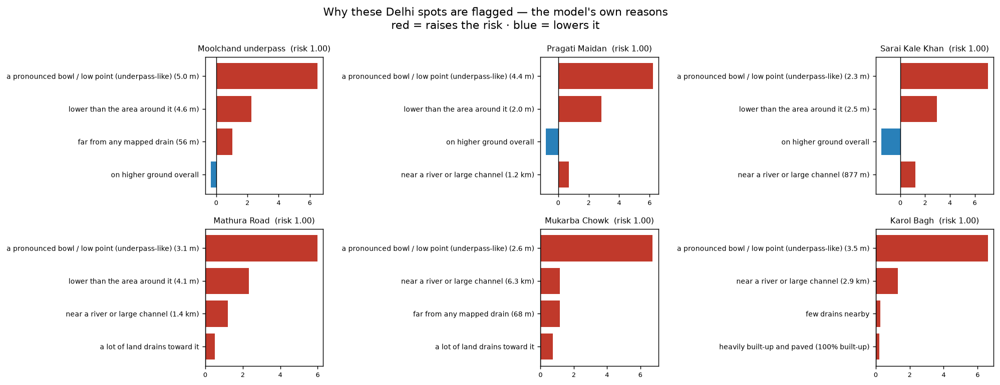

# urban-flood-ml

**An open tool that maps where Indian cities flood — so the people who live in the most at-risk streets can be warned to prepare.**

Most flood maps stop at the river. But the flooding that actually traps people is the *street waterlogging* — the underpass that fills up, the junction that becomes a lake every monsoon. This project maps **both**, for four cities, from free satellite and public data — built so that, with a rainfall trigger on top, it could one day **alert residents of high-risk neighbourhoods before the water arrives**. It's a public-good project, not a commercial one.

### ▶️ [Open the live map →](https://agambear25.github.io/urban-flood-ml/)
A search-first map across **4 cities**. **Click any hotspot** for the model's own reasons it floods (Minto Bridge → *"a pronounced low point, far from a drain…"*). **Play past monsoons** to see real rainfall on each recorded flood event. Or **plan a route** and it flags the known flood spots you'd pass and suggests a lower-risk way round. Honest by design — confidence, coverage gaps, and "what it can't see" are shown, not hidden.


---

## What it does

- 🛰️ **Finds where floods actually happened** — reads Sentinel-1 satellite radar (which sees through monsoon cloud) across *multiple* historical floods per city.
- 🗺️ **Maps two kinds of flooding** — a **river/floodplain** model *and* a separate **street-waterlogging** model (the ponding in low spots and underpasses that the satellite can't see).
- 📍 **Names the danger spots** — a traceable database of documented waterlogging hotspots, shown on the map by name.
- 🏙️ **Covers 4 cities, scales to any** — Delhi, Mumbai, Bengaluru, Chandigarh today; a new city is one config file, not new code.

**The point:** translate "this area is flood-prone" into "*these specific streets*, and *these people*" — the first step toward warning residents to move vehicles, clear drains, and prepare.

## How it works, in plain terms

1. **Find** — satellite radar shows where water sat during past floods → that's the training signal.
2. **Learn** — a model studies the ground at those flooded spots (low? flat? a dip? near a drain?) and learns the pattern.
3. **Map** — it shades every *other* place that shares the risky pattern, and overlays the named hotspots people already know flood.

A rainfall forecast on top turns this static risk into a *"prepare today"* alert — the natural next step.

## Honest about its limits

This is an **experimental planning aid, not an official warning system.** River flooding is detected well; in-street waterlogging is harder (the satellite barely sees it, so that model leans on documented hotspots + terrain). Risk is *relative* within each city, and the hotspot list is media/advisory-derived, not exhaustive — **absence of a marker doesn't mean safe.** These limits are stated on the map itself. Saying them plainly is part of doing this responsibly.

---

## How well does it actually work? (the honest test)

A model that does well on the same city it learned from hasn't proven much. The real test: **let it learn from three cities, then ask it about a fourth it has never seen.**


The honest result: it **carries over reasonably well to unseen inland cities**, but it **almost falls apart on Mumbai** — close to a coin-flip — because Mumbai floods from the sea and the tides, something the inland cities never taught it. That's a useful failure: it points straight at what to build next.

Two things the test was careful to be honest about:
- **Floods are rare** — only 3–6% of the map. On a needle-in-a-haystack problem like that, a plain "accuracy" number makes any model look good, so the scores here are measured the fairer, harder way — and they come out soberer. That's the point.
- **The raw risk scores weren't real chances.** The model was trained on an even mix of flooded and dry ground, so its numbers ran hot. A standard correction fixes that — now a "1-in-5" on the map genuinely means about one-in-five.

📊 **[The full write-up — how it's measured, the exact numbers, and the charts → EVALUATION.md](EVALUATION.md)**

---

## Ask it why a place floods

The map isn't a black box. For any spot, the model can show the reasons behind its score — and they hold up against common sense.



Run on the documented hotspots, the reasons are consistent and physically sensible: almost every flooded underpass comes back as **a pronounced dip / low point**, usually plus *lower than the surrounding area* and *far from a working drain*. (These spots are the model's own known examples, so it rates them high regardless — the useful part is the *reason*, and it matches why underpasses flood in real life.) One command: `floodml explain delhi`.

---

## Where it's going next (v2)

v1 answers "*which areas* are flood-prone." v2 turns that into something closer to a real warning system — and is honest about exactly how far the data lets it go:

- **Drains as a network, not just squares.** Model the real drains (like Delhi's Najafgarh) and which neighbourhoods feed each one — so a reported overflow raises the risk of everywhere downstream, the way water actually behaves.
- **Weigh every report by how much it can be trusted** — using the rainfall at that time, whether multiple sources agree, and known bad spots; satellite imagery only where it could actually see (rarely, in the monsoon), and never as the deciding vote.
- **Forecasts that never overclaim** — a 3-tier outlook whose confidence shrinks with how far ahead it looks: a real warning at 0–3 days, a city heads-up at 3–10 days, and only a "wetter / drier than usual" regional signal at 2–4 weeks. Never a fake street-level forecast weeks out.
- **Evaluation that survives scrutiny** — ✅ *first cut shipped (see the cross-city test above)*: train on some cities and predict an *unseen* one, a fair score for rare events, and calibrated confidence.

📐 **[Read the full design →](DESIGN.md)**  ·  🗺️ **[Roadmap →](ROADMAP.md)** — the reasoning, the data limits, and the build order, all in plain English.

---

<details>
<summary><b>🔧 For developers</b> (click to expand)</summary>

### Pipeline — config-driven, one command per stage
```bash
floodml run delhi             # multi-event SAR flood label → features → train → predict
floodml train-waterlog delhi  # the urban-waterlogging (hotspot) model
python events/build_events.py # the traceable event database
```
A city is a YAML in `configs/city/` + a hotspot list in `configs/hotspots/`. No copy-pasted code.

### Two models per city (within-city spatial-CV AUC)

| City | River (multi-event SAR) | Street waterlogging (PU) |
|---|---|---|
| Delhi | 0.80 | 0.96 |
| Chandigarh | 0.79 | 0.99 |
| Bengaluru | 0.73 | 0.97 |
| Mumbai | 0.70 | 0.97 |

**What these numbers are — and aren't.** They come from holding out **areas within each city** (spatial block cross-validation), already stricter than the random splits that inflate most published flood-ML scores. But the *harder, more honest* test — **train on some cities and predict an unseen one** — is now measured in **[EVALUATION.md](EVALUATION.md)**: on a city it has never seen, ROC-AUC drops to **0.59–0.77** and the rare-event PR-AUC to **0.08–0.19**. Those are the numbers I'd want to be judged on. The street-waterlogging model is positive-only (PU) learning, so its scores are **relative ranking, not calibrated probabilities**; its top driver is `sink_depth` (local depressions / underpasses) in every city — the real street-ponding mechanism. River AUCs are honestly lower than single-event numbers because multi-event labels across whole metros are a harder, more realistic task.

### How it's built
- **Labels** — multi-event Sentinel-1 change detection (each city stacks several real floods → frequency-weighted label). Street-flood labels come from geocoded documented hotspots (positive-only PU learning).
- **Features** — terrain (elevation, slope, HAND, curvature, local relief, sinks) + drainage backbone (MERIT-Hydro + OSM drains).
- **Models** — per-city XGBoost, validated with **spatial block cross-validation** (the honest metric).
- **Event DB** — `events/` — provenance-rich records from documented hotspots + GDELT news + Global Flood Database, with flood-news frequency over time.
- **Engineering** — installable `floodml` package, **Typer** CLI, **Pydantic** configs, **MLflow** tracking, **GitHub Actions** CI. (Deliberately no Kubernetes/Airflow — overkill for this.)

### Reproduce
```bash
conda env create -f environment.yml && conda activate urban-flood-ml
floodml run delhi   # needs a free Google Earth Engine account (set ee_project in the config)
```

The detailed plan for what's next is in **[ROADMAP.md](ROADMAP.md)**.

</details>

---

*Built with Sentinel-1, Copernicus DEM, MERIT-Hydro, ESA WorldCover, WorldPop & OpenStreetMap (via Google Earth Engine). Free data, open code, public purpose.*
